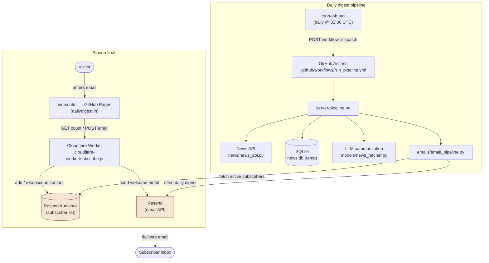

# Daily Digest
Daily Digest is an automated daily newsletter that curates and delivers the top 10 most important news stories to all registered users, ensuring they stay informed with concise and relevant updates every day.

## Architecture

**Signup flow:** a visitor enters their email on the site (hosted on GitHub Pages under `dailydigest.in`), which calls a Cloudflare Worker. The Worker adds the contact to a Resend Audience and sends a personalized welcome email via Resend.

**Daily digest pipeline:** cron-job.org triggers the GitHub Actions workflow once a day (GitHub's own built-in `schedule:` trigger is unreliable, so an external scheduler calls `workflow_dispatch` on the Actions API instead). The workflow runs `pipeline.py`, which fetches the day's headlines, stores them temporarily in SQLite, summarizes the top 10 with an LLM, then emails the digest to every active subscriber pulled from the same Resend Audience.
